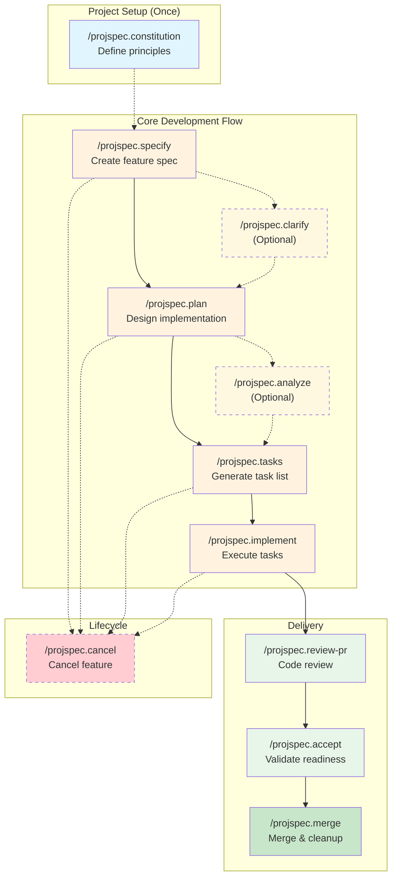

<div align="center">

# 📋 ProjSpec

### Specification-Driven Development for Claude Code

[](https://github.com/liorfranko/projspec/stargazers)
[](LICENSE)
[](https://github.com/anthropics/claude-code)
[]()

**Turn feature ideas into working code through guided specification, planning, and implementation.**

[Getting Started](#-quick-start) · [Commands](#-commands) · [Documentation](projspec/README.md)

</div>

---

## 🎯 Why ProjSpec?

| Problem | Solution |
|---------|----------|
| AI agents lose context in large codebases | **Structured specs** keep context focused and traceable |
| Features drift from original requirements | **Explicit traceability** from spec → plan → tasks → code |
| Code quality varies without review | **6 specialized agents** review before PR creation |
| Manual task breakdown is tedious | **Automated task generation** with dependency ordering |

---

## 🔄 Development Workflow



## 📦 Installation

Install directly in Claude Code:

```bash
/plugin install projspec@claude-plugin-directory
```

Or browse available plugins:

```bash
/plugin > Discover
```

---

## 🚀 Quick Start

```bash
# 1. Set up project principles (optional but recommended)
/projspec.constitution

# 2. Create a feature specification
/projspec.specify implement user authentication

# 3. Generate implementation plan
/projspec.plan

# 4. Generate tasks
/projspec.tasks

# 5. Implement (choose execution mode)
/projspec.implement           # Agent mode (default) - isolated context per task
/projspec.implement --direct  # Direct mode - faster, sequential execution

# 6. Review code quality
/projspec.review-pr

# 7. Validate readiness
/projspec.accept

# 8. Merge and cleanup
/projspec.merge --push
```

---

## 📚 Commands

### Core Workflow

| Command | Description |
|---------|-------------|
| `/projspec.specify` | Create feature spec with requirements and success criteria |
| `/projspec.clarify` | Ask targeted questions to resolve ambiguous areas |
| `/projspec.plan` | Generate implementation plan with architecture decisions |
| `/projspec.tasks` | Create dependency-ordered task breakdown |
| `/projspec.implement` | Execute tasks with agent or direct mode |
| `/projspec.review-pr` | Run 6 specialized agents for code review |
| `/projspec.accept` | Validate feature readiness (tasks, docs, tests) |
| `/projspec.merge` | Merge feature branch and cleanup worktree |

### Utilities

| Command | Description |
|---------|-------------|
| `/projspec.analyze` | Cross-artifact consistency analysis |
| `/projspec.constitution` | Define project principles and constraints |
| `/projspec.cancel` | Cancel feature and cleanup resources |

<details>
<summary><strong>🤖 Specialized Review Agents</strong></summary>

| Agent | Focus |
|-------|-------|
| **Code Reviewer** | Correctness, maintainability, security |
| **Silent Failure Hunter** | Missing error handling, swallowed exceptions |
| **Code Simplifier** | Complexity reduction, refactoring opportunities |
| **Comment Analyzer** | Comment accuracy, necessity, quality |
| **PR Test Analyzer** | Test coverage and quality gaps |
| **Type Design Analyzer** | Type safety, interface contracts |

</details>

👉 **[Full Documentation](projspec/README.md)** — All commands with examples, agent details, and workflow diagrams.

---

## 📁 Repository Structure

```
projspec/
├── projspec/                    # The Claude Code plugin
│   └── plugins/projspec/
│       ├── commands/            # Slash commands (/projspec.*)
│       ├── agents/              # Specialized review agents
│       ├── templates/           # Spec, plan, task templates
│       ├── scripts/             # Helper bash scripts
│       └── memory/              # Default constitution and context
├── specs/                       # Feature specifications (this repo's own specs)
└── tests/                       # E2E tests for the plugin
```

---

## 🛠️ Development

<details>
<summary><strong>Git Worktree Workflow</strong></summary>

This project uses git worktrees for feature isolation:

```bash
# Feature development happens in worktrees
worktrees/<NNN-feature-name>/

# Feature specs live in the worktree
worktrees/<feature>/specs/<feature>/

# After PR merge, specs appear in main repo
specs/
```

</details>

<details>
<summary><strong>Running Tests</strong></summary>

```bash
# Run E2E tests
pytest tests/e2e/ -v
```

</details>

---

## 🤝 Contributing

Contributions are welcome! Please feel free to submit a Pull Request.

---

## 📄 License

MIT — see [LICENSE](LICENSE) for details.

---

<div align="center">

**Built with ❤️ for the Claude Code community**

</div>
