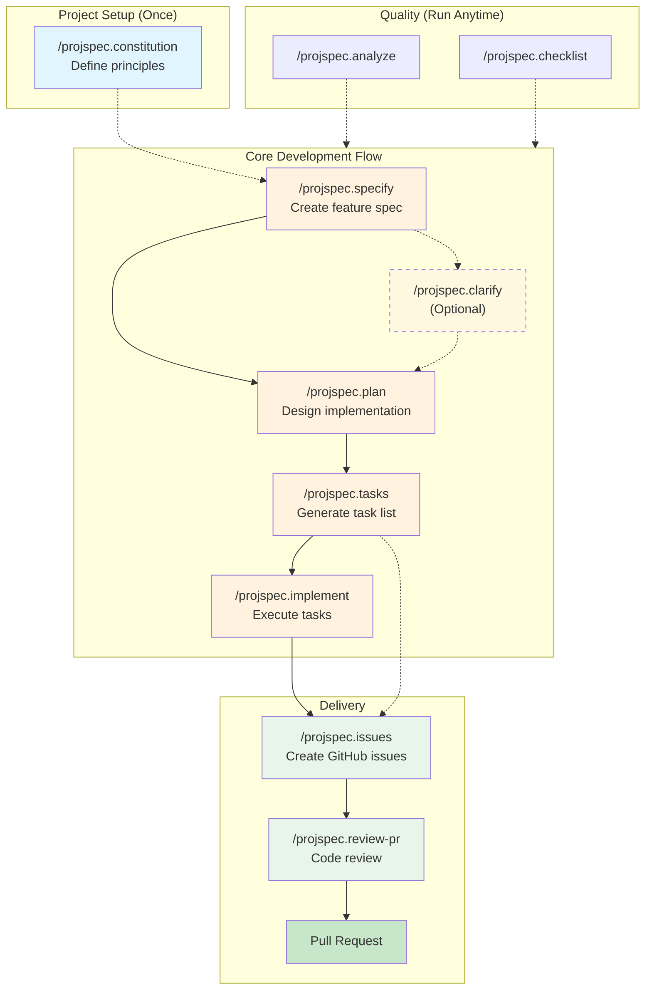

# ProjSpec

A Claude Code plugin for specification-driven development workflows.

## Overview

ProjSpec provides a structured approach to feature development by guiding you through specification, planning, task generation, and implementation phases. It ensures consistency and traceability throughout the development lifecycle.

## Development Workflow



## Installation

Install directly in Claude Code:

```
/plugin install projspec@claude-plugin-directory
```

Or browse available plugins:

```
/plugin > Discover
```

## Quick Start

```bash
# 1. Set up project principles (optional but recommended)
/projspec.constitution

# 2. Create a feature specification
/projspec.specify implement user authentication

# 3. Generate implementation plan
/projspec.plan

# 4. Generate tasks
/projspec.tasks

# 5. Implement (choose execution mode)
/projspec.implement           # Agent mode (default) - isolated context per task
/projspec.implement --direct  # Direct mode - faster, sequential execution

# 6. Review before PR
/projspec.review-pr
```

## Documentation

See [projspec/README.md](projspec/README.md) for complete documentation including:

- All 11 commands with usage examples
- 6 specialized agents for code review
- Workflow diagrams
- Feature directory structure

## Repository Structure

```
projspec/
  projspec/                    # The Claude Code plugin
    plugins/projspec/
      commands/                # Slash commands (/projspec.*)
      agents/                  # Specialized review agents
      templates/               # Spec, plan, task templates
      scripts/                 # Helper bash scripts
      memory/                  # Default constitution and context
  specs/                       # Feature specifications (this repo's own specs)
  tests/                       # E2E tests for the plugin
```

## Development

This project uses git worktrees for feature isolation:

```bash
# Feature development happens in worktrees
worktrees/<NNN-feature-name>/

# Feature specs live in the worktree
worktrees/<feature>/specs/<feature>/

# After PR merge, specs appear in main repo
specs/
```

### Running Tests

```bash
# Run E2E tests
pytest tests/e2e/ -v
```

## License

MIT
